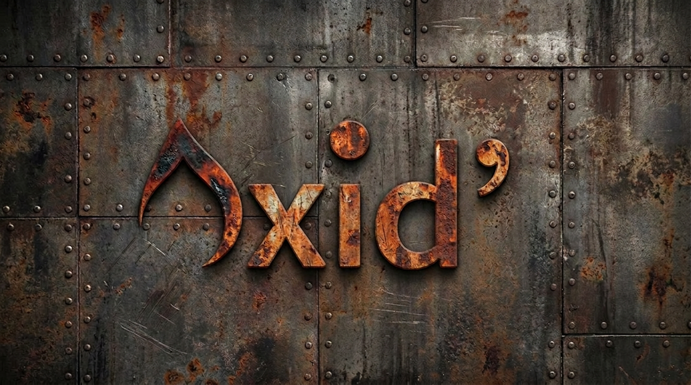

# Oxide Chess Engine



A 2400 Elo UCI-compatible chess engine written in Rust. Self-contained single binary with embedded NNUE evaluation.

## Usage

Run directly from source:

```bash
cargo run -r -- <command>
```

Or build and run the executable:

```bash
cargo build -r
./target/release/oxide <command>
```

The binary is fully self-contained — the NNUE network is embedded at compile time, no external files needed.

### Benchmark

```bash
cargo run -r -- bench              # Default: depth 13, 16 MB hash
cargo run -r -- bench 32 1 15      # Custom: 32 MB hash, 1 thread, depth 15
```

### UCI Options

| Option | Type | Default | Description |
|--------|------|---------|-------------|
| `Hash` | spin | 16 | Transposition table size in MB (1-512) |
| `EvalFile` | string | `<embedded>` | Load a different NNUE net at runtime |

It does not come with a GUI. You can use [Cute Chess](https://cutechess.com/) or [Arena](http://www.playwitharena.de/).

## Performance

On a benchmark of 46 positions search at depth 13:

```
Total time (ms) : 61047
Nodes searched  : 46575003
Nodes/second    : 762936
```

and for pure perft on 1 thread without any movegen hashing:

```
Perft aggregate: 18652422582 146567ms 127.26 MNodes/s
```

## Features

### Board Representation

* Magic bitboards for sliding piece attacks
* Bitboards with Little-Endian Rank-File (LERF) mapping
* Hybrid mailbox + bitboard representation
* Incremental Zobrist hashing

### Search

* Negamax with alpha-beta pruning
* Iterative deepening with aspiration windows
* Principal Variation Search (PVS)
* Transposition table with age-based replacement, best move, depth, and node type
* Mate score adjustment for TT storage
* Correction history (pawn-hash indexed static eval error tracking)
* Quiescence search (captures, en passant, promotions)
* Check extensions
* Null move pruning
* Reverse futility pruning
* Razoring
* Futility pruning
* Late move pruning (LMP)
* Late move reductions (LMR)
* SEE pruning (static exchange evaluation)
* Delta pruning in quiescence
* Staged move generation (MovePicker) with lazy legality checking
* Move ordering: TT move > good captures > killers > countermove > quiets > bad captures
* Capture history and continuation history (1-ply + 2-ply) for move ordering
* History malus for quiet moves tried before beta cutoffs
* Granular history-based scaling for LMR, LMP, and futility thresholds

### Evaluation

* NNUE evaluation (768->256x2->32->1 SCReLU architecture, integer quantized)
* Incremental accumulator updates (push/pop with activate/deactivate per move)
* Optimized forward pass: pre-computed SCReLU activations, transposed L1 weights
* Embedded net via `include_bytes!` — no external files at runtime
* Runtime net loading via `EvalFile` UCI option for SPRT testing

### NNUE Net Management

Nets use SHA256-based naming: `nn-{first 12 hex chars}.nnue`. Only the active (promoted) net is committed to git; all others are gitignored.

* `scripts/convert_checkpoints.sh` — converts training checkpoints to `.nnue` format
* `scripts/promote_net.sh <path>` — promotes a net as the new embedded default

## Documentation

Detailed documentation is available in the [`docs/`](docs/) directory:

* [Architecture](docs/architecture.md) — Module overview, component wiring, core types
* [Search](docs/search.md) — All search techniques, pruning, reductions, move ordering
* [Evaluation](docs/evaluation.md) — Tapered eval, material values, piece-square tables
* [UCI Protocol](docs/uci.md) — Supported commands and options

## Acknowledgements

* A huge thanks to [@mvanthoor](https://github.com/mvanthoor) for his work on [Rustic](https://github.com/mvanthoor/rustic) that helped me understand a lot of concepts in Rust.
* Also a big part of my way of thinking was influenced by [Stockfish](https://stockfishchess.org/). It was also a great tool to debug my code.
